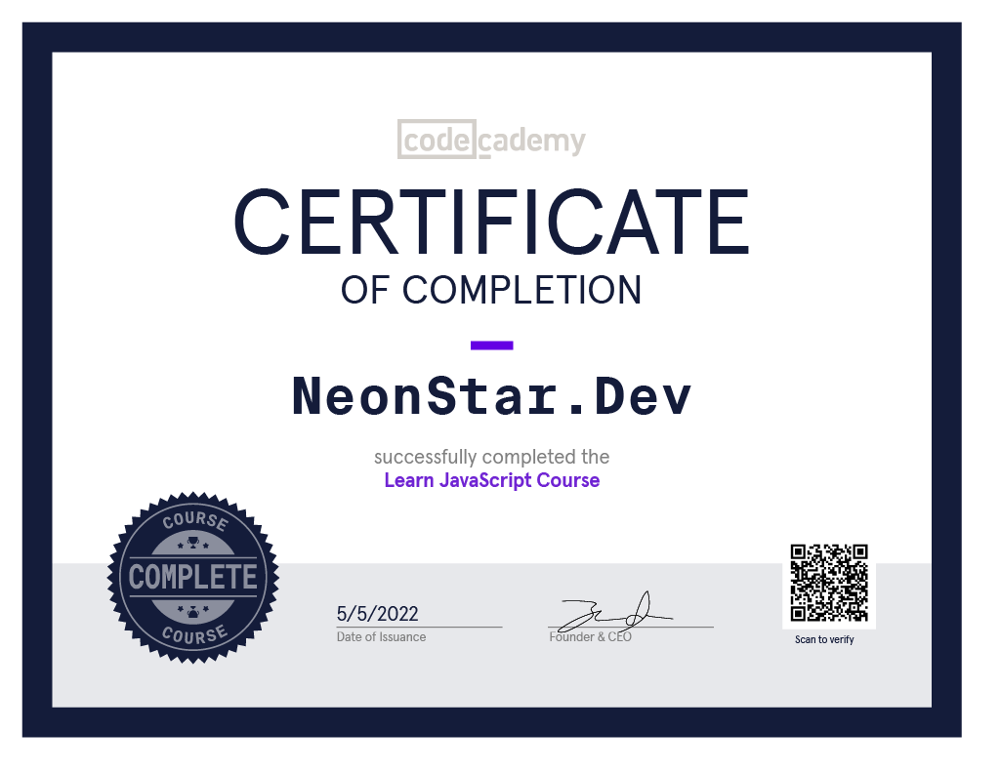
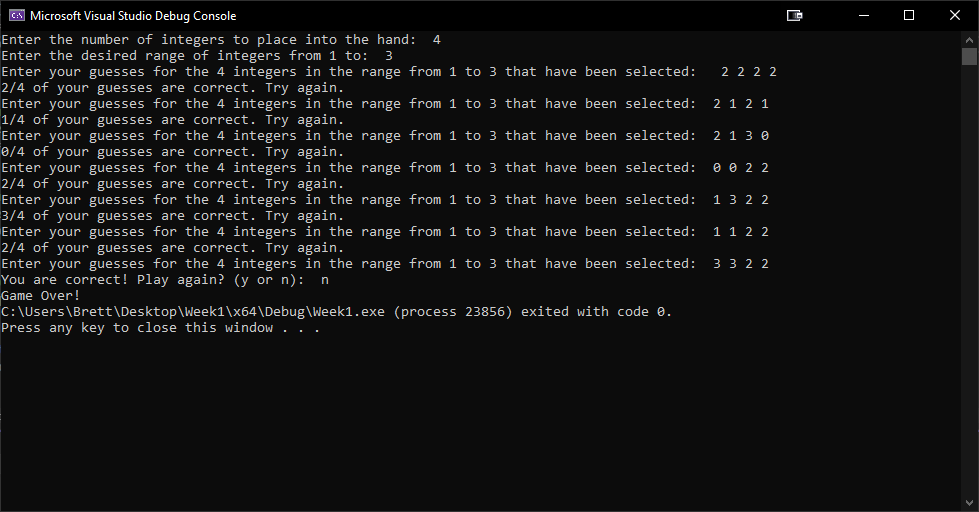

# 100 Days of Code | Round 1
### May 4, 2022 - August 11, 2022
### What I'm targeting
* Languages
    * C++
    * Javascript/Web Development 
    * Python
* Skills
    * Continuous Integration/Continuous Deployment
    * Data Structures and Algorithms

## Day 1 - May 4, 2022
Started work on a GitHub workflow that would automate my daily tweet. Found out I'm jumping in too quick and it'll probably take a little more time to figure out than I thought. I found several actions that have already been created but I think I might have to create my own because of the way I want it formatted. Putting that project back on the shelf for now, I'll break it back out. Glad to have finally started on this journey however!

## Day 2 - May 5, 2022
Jumped back onto my [Codecademy](https://www.codecademy.com/) account and finished the Javascript course! I'm working my way through the Web Development course which I plan to finish this Summer! 

I already had progress completed in this course so where I picked up today dealt with objects. Being used to Java, getting the syntax down is still taking a bit, but I think I like the way JS handles it. Tomorrow I'll continue the webdev course by working on the post course projects for JS and starting into the "Building Interactive JavaScript Websites" module! 

## Day 3 - May 6, 2022
Seemed to be some connection issues going on today, whether it was on my end or [Codecademy](https://www.codecademy.com/) I'm not sure. I pushed through the first section of the "Build Interactive Websites with JS" module though! today I learned how to target HTML elements with JS. I've had some practice with this before in a class a few semester back but we didn't spend nearly enought time in my opinion going over the DOM. I feel like I've got the basics down when it comes to targeting elements with Javascript and it would probably be best to start a project to practice even further!

## Day 4 - May 7, 2022
Continuing on with the Web Dev course, I dealt with more JS events today. I got to play around with the different kinds of events that can be fired including mouse events and keypress events. Pretty simple stuff but it was a nice review! As for new material, I also covered handlebars.js today. The handlebars library allows you to edit HTML documents through javascript and even includes conditional handling within HTML. I feel like this makes a lot of concepts I had thought before as difficult, seem a lot easier. Ready to move on to Intermediate Javascript from here!

## Day 5 - May 8, 2022
Given that today is Mother's Day, I wasn't able to spend a lot of time here today. Made the most of it and pressed forward a bit though! Today I reviewed some JS documentation and practiced some of what I've been doing the last few days. I really like JavaScript but I'm not sure I see myself sticking with it for a future career. That could change as I get into some frameworks though, excited to continue on!

## Day 6 - May 9, 2022
Continued my progress in the web development course. Today I finished the module on classes which was essentially review to me. In previous classes at school I never struggled much with most of the concepts of OOP (Object Oriented Programming). The module basically demonstrated how to create classes and subclasses and then how to use inheritance between them. Even though I've got this stuff down its always good to practice! I will say that the JS syntax seems extra wordy coming from Java development.

The rest of this week I plan to clean up what I can on this web dev course, maybe even finishing it if possible, as next week is when my Summer semester begins. This Summer I'll be more focused on C++ development and learning my data structures and algorithms, the latter being something I am ready to learn with cautious excitement. As for C++, it is where I started in programming once I got to school and I'm excited to get back into it. I'm interested to see if I prioritize it over using Java. 

## Day 7 - May 10, 2022
Played around with modules today and how to use them both with ES6 and Node.js. Spent quite a bit of time reviewing as some of this initially came across as tricky. I need to keep practicing with exporting and importing from modules as some of the projects within the course tripped me up a little bit. 

I then took a little break and started loosely planning out an idea my partner and I came up with to help us plan our meals. I really like the idea and definitely need to start adding some projects to Github to demo for later!

## Day 8 - May 11, 2022
Continued planning out the meal prepping idea. Got an idea for what kind of functions I need and breaking down the bigger concepts behind what I'm actually doing. Currently juggling back and forth whether to use a relational database for the backend or just simple object creation. Additionally I'm juggling between using Java or C++ so that I can make additions as I learn more learning C++ development this Summer. 

## Day 9 - May 12, 2022
Continued onward with the web development and planning out my meal prepping app. I decided that I'll go ahead and implement it with C++ so that I have an instructor to bounce ideas off of to really improve it. Additionally I started refamiliaring myself with C++ syntax as it has been at least 2 years since I last wrote any code using it. Probably how I'll spend the rest of the weekend leading up to class starting next week. I'm not exactly sure how prepared I'm expected to be going into this course but I believe the more advanced classes I've already taken weren't pre-reqs. Leads me to worry one way or the other that A.) I might struggle a bit at the start or B.) the class might be a bit below where I currently am and I won't get as much out of it. We'll see though, I'm excited to move into it regardless!

## Day 10 - May 13, 2022
It's already been 10 days, that's crazy! I had a feeling this would go fast. While I know I am definitely learning new things at least with Javascript, I don't feel like I've made huge noteworthy progress yet. Hopefully at Day 20 I have something cool to show off!

Today I finished the Intermediate JavaScript module! Just a quick rundown of the things I reviewed:

* Practiced debugging
* Reviewed error types
* Try... catch error handling
* Promises
* Async... await
* Fetch API requests 

I have experience with threads in Java which didn't take long for me to pick up on so this came rather easily as well! Playing with API's was something I wanted to practice more this summer after having some projects based around it last semester. The GET and POST requests are a bit higher level than I was expecting so some more review will definitely be needed there.

## Day 11 - May 14, 2022
Today I breezed through the command line and github modules. Considering I'm doing all of my updating of this repo, and even this file, through bash I didn't find any particular difficulty there. I did start thinking about new ways to automate my process here though and I think I'll give that another shot since the git workflow didn't work. 

The github articles were interesting and I especially liked the pull requests section. I'm nervous to get into collaborative work but I'm going to have to at some point. I also really enjoyed learning about Github pages. That's something I could see myself using sooner rather than later. 

## Day 12 - May 15, 2022
* JS transpilation with Babel
* React.JS
  * JSX

Continuing into the 10th of 14 modules on the web dev course, I started learning React.JS today! The module began with transpilation with Babel which was a cool thing to learn. The next section focused on how to use JSX syntax to combine JavaScript and HTML. The React module is certainly heavy so I'm going to be learning a lot about it over the next few days.

Additionally I started peeking around at python documentation to figure out how I can automate my tweet for my daily log on twitter. My idea is sticking a python script to run inside the alias I already use to add, commit, and push this file each update. The python script would take the opening of each day (where I plan to use a list like I did today) and tweet it on my account. Meaning I would just type "100update" into my bash and my all updates are automatically taken care of for me!

## Day 13 - May 16, 2022
Continued work on automation! My python script is almost done I just need to connect it to Twitter. Right now it reads through my markdown file and places the latest log in a string to tweet.

The way I have the script setup is that it will always target the first line after finding "# Day" in the file. I allow 200 characters for the tweet string (to save room for the hashtag and my day counter), anything over that and it'll make a substring up to the last period under 200 characters and end the string with an ellipsis. Not the most exciting thing but automating this has been a ton of fun! Once I finish this and clean up the code so my API keys aren't published to the open internet, I'll load it up into GitHub as I'm sure there are others on the 100 days journey that would take interest in some automation. Also at the very least I want to show employers that I'm actually using my skills for more than just hobbyist passion projects. 

I've really enjoyed poking in python the last 2 days. Once I'm done with the web dev course I'm going to continue learning as Python is probably going to be a lot more helpful to me in the long run.

## Day 14 - May 17, 2022
Almost done with my automation script. At this point I'm just waiting to be granted elevated access from Twitter! Once I'm sure it works I already have a local repo with everything ready to be pushed!

While I wait I've started working on the README file for the repository. It may not be "coding" but practicing writing documentation is something I should absolutely be working on. Not much more to report today. Most of my time was spent refactoring the update100.py code making it a bit more seemless and then using more variables in my bash script. Real happy for myself for returning to working on this so quickly after being quite dissapointed with my automation idea on Day 1. Also still excited to be playing with Python!

## Day 15 - May 18, 2022
Finishing up documentation today, still waiting on elevated access!

Figured twitter would've given me the ability to write but they haven't yet. I may have to reapply and give better descriptions of what I'm doing. As for what I actually accomplished, most of the documentation and code refactoring for update100 is done. Excited to have an automation skill highlighted on my GitHub!

## Day 16 - May 19, 2022
Update100 is totally complete including documentation! In fact, this tweet was tweeted by update100! I've had so much fun learning automation. I'll have this project on my GitHub soon!!

Not a whole lot more to add here. Playing with all these components individually has been a lot of fun. If there's anything I've learned its that I actually *LOVE* Python. I could definitely see myself sticking with this for a lot of things going forward and I'm excited to start picking up more through Codecademy later on this Summer!

## Day 17 - May 20, 2022
Update100 has been pushed to GitHub, check it out in the reply to this tweet! I have some work I want to do with documentation to make it look more professional but I'm happy overall!

Happy that I've done what I wanted with update100 but I have further plans now. I've added media to this log previously and I would like to include future media in whatever tweet I send. That said, the next feature I wanna work on for update100 is scanning through each update looking for any media and attach them to the tweet. I tried it a bit this morning and found that the script ran an infinite loop. Not exactly sure where it was happening though so that'll take some further testing!

Here is the repo for [update100](https://github.com/NeonStar-Dev/update100)!

## Day 18 - May 21, 2022
Had a VERY busy day working on classwork. My data structures and algorithms class is no joke, definitely need to spend some more time with C++. Back at it again tomorrow!

Struggled getting through this project. I think my code is solid but having to tinker with a new IDE is setting me really far back. Expect tomorrow's update to be similar to today's as not only do I have to finish this but I've got some graduation traveling to do as well.

## Day 19 - May 22, 2022 
Early update! Probably one of the less spoken parts of learning to code: knowing when to put it down and come back later. Last night was very frustrating but after a night's rest, I solved my issues!

Noticed myself having this problem over the entire course of my degree so far. I would say getting some hard to work through bugs happens rather infrequently for me but when it does it sure does drive me up a wall. Considering I'm dealing with school where I have strict criteria and deadlines to meet, it sends my frustration to a new level when I can't figure something out. Almost every time though, I take a step back and give it some time and come back much stronger. Maybe the real stress problem here comes from procrastination, hmmm...

I finished my Data Structures and Algorithms class assignment for the first week. Given that it's a school assignment I can't post the code, but here's a screenshot of it in action! Simple guessing game implemented in C++ that creates a vector and populates it with a user specified amount of integers in a range between 0 and another user specified amount. The user then guesses the numbers in the "hand", looping until they are correct.

## Day 20 - May 23, 2022
Officially 1/5 of the way there! Time's flying by already. Today I started my C++ Development course and reviewed my skills in file IO with a simple assignment. Not really sure how much I like it yet

In some ways C++ feels more complicated than Java. While I am still pretty new to C++, Java seemed to be a lot more intuitive. There also seemed to be so many more tools to help me. Really not a fan of having to declare the functions before they're used, that's gonna trip me up before I start getting used to it. Looking forward to expanding my knowledge though!

## Day 21 - May 24, 2022
Spent almost all day working on calculus homework, so I didn't have the brain power to work on much. Kept up with some reviewing of documentation though, progress is progress!

## Day 22 - May 25, 2022
Today I started making some progress on my meal planner project. I've got a proof of concept down, now I'm just deciding how I want to store my recipes!

Going back and forth on whether I just want to format recipe files a certain way and have the program search through a folder or if I want to create an entire database that I can pull information from. While I have knowledge on using SQL, starting the database itself is something I still don't have the greatest grasp on. More practice I suppose.

## Day 23 - May 26, 2022
Another homework day, loooooots of reading. Starting to feel a bit more comfortable with C++ though. Do you prefer C++? Java? Another language?

## Day 24 - May 27, 2022
This week in my algorithm class we're focusing on data abstraction. Our assignment was just to refactor the first assignment and I couldn't find much to refactor! Been feeling real confident lately!

As soon as we started playing with classes in a previous java class I felt pretty comfortable with the ideas of encapsulation and abstraction. "Keep as much inside the black box" is a concept that fundamentally makes sense to me. Feels like I already have the right mindset about development going into this class!

## Day 25 - May 28, 2022
Officially 1/4th of the way there! Spent today practicing setting up header files. Kind of tripped up on those last week, wanna make sure I got them down. 

## Day 28 - May 31, 2022
Unfortunately I've been away and unable to make any progress, back at it today though! Played with classes and polymorphism in C++. I guess I'm starting to warm up to it, I still prefer Java though.

## Day 30 - June 2, 2022
Spent today working with recursion! Doesn't seem as tough as it did last time I messed with it. Also fixed a little bug in my automation script, my day count should be accurate now!

At first I thought this data structures and algorithms class would be pretty difficult but looking ahead now, I feel like I have the basics of a lot of these concepts. Judging by how confident I felt about recursion when I started reading this chapter, I think I'll do alright this semester. 

As for the bug, I noticed in my last update that the day counter was off in the tweet. After reviewing the code I realized that I didn't actually have a proper day counter built in. Now it reads through my Day xx/200 title line and retrieves the first number in the line (so for me the correct day). Won't know if it works till I try it with this update though!

Kind of fell off for a few days. Getting back into it strong though! I have lots I should be working on, time to get it done.

## Day 31 - June 3, 2022 
Finished up my recursion project and played with file IO in C++!

The recursion project was astonishingly simple. It really was just implementing a binary search algorithm. Expected it to take a bit longer than it actually did. The file IO stuff is always fun for me though. I've gotten quite used to loading data to and from!

## Day 32 - June 4, 2022
Worked more on File IO in C++ today! Got this update in a little late oops!

## Day 33 - June 5, 2022
Finished my File IO project, Visual Studio has been a trip to learn. Definitely prefer VS Code instead. Also cleaned up my README file for update100, I think it looks a lot better!

I'm going on vacation in about 3 weeks so I'm going to be trying to bust out as much as this C++ coursework as I can. Once I can get done with this I'll jump back on Javascript, Python, and practicing automation!

## Day 34 - June 6, 2022
Reviewed my sorting algorithms today. Should've done this at the beginning probably cause it's definitely not going away now!

It's really bubble sort that I've been having trouble with but I think that's more because of the assignment basis rather than the actual understanding itself. Seems like practice problems are in a language of their own sometimes!

## Day 35 - June 7, 2022
Practiced implementing sorting algorithms some more. I really need to get bubble sort down!

## Day 37 - June 9, 2022
Added some features to my discord bot today! Playing around with server commands.

Wanted to try something a little more fun today. Refactored a lot of code and started adding some actual commands!
